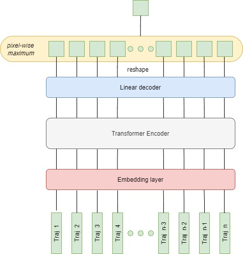
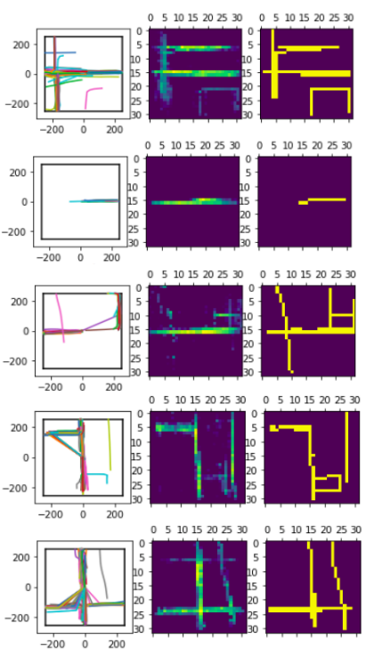
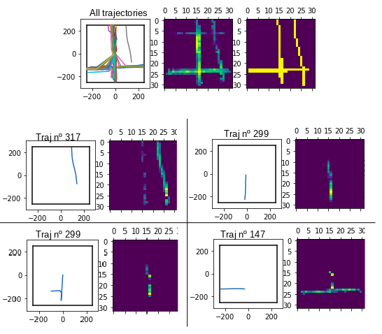

If you want to know the purpose of this repo read "Deep Map Construction". If you want to know the content of this repo read "Repository structure".

# Deep Map Construction

This repository contains a deep learning approach for the Map Construction problem. 
Map Construction is the task of building a road map (usually represented as nodes with coordinates representing the intersections and edges that represent the roads between intersections) from GPS trajectories. Accurate road maps are crucial for travel efficiency and safety, so being able to automatically create maps from (often noisy) GPS trajectories is a task with an incredible potential to improve the quality of these maps. More information about map construction algorithms can be found in [mapconstruction.org](mapconstruction.org).

## Approach

The approach presented in this repository is a deep neural network that takes as input a set of trajectories and outputs an "image" of the corresponding road map. We refer to the image of a road map as the rasterization of the graph, that is, drawing the map in a matrix where each cell (or pixel) is illuminated if a road crosses over it. The reason of this decision is the difficulty of representing graphs with neural networks. Some attempts at creating embedded road graphs compatible with neural networks have been done such as in [Sat2Graph](https://github.com/songtaohe/Sat2Graph). However, it is also possible to apply post processing algorithms to obtain a graph from the image of the map.

Given that the resolution of the output image is fixed, we must bound the area of the map that the neural network has to process. This is why, to train the neural network, we fix the area of a sample by selecting all trajectories (cropping them if necessary) that cross over a squared tile of a given size.

## Architecture

The reasoning behind the architecture is the following: we want to map each trajectory into the final image according to the road it belongs. This has to be done by looking at all the other trajectories (specially the ones next to the given trajectory) in order to locate the road belonging to our trajectory. When we have all trajectories separately mapped to the road they belong, it makes sense to just join all of them into the final map. 

In this section we present the architecture of the neural network.
First, we apply an embedding layer (linear layer) to each trajectory in order to obtain a feature vector of the trajectory. Then the embedded trajectories are fed to a Transformer Layer. This layer makes the necessary adjustments to each trajectory based on other trajectories, so it is the one who makes the corresponding associations between trajectories by means of the "attention" mechanism. Finally, a linear decoder (linear layer) expands the output of the transformer into a vector with dimensions $s \cdot s$, where $s$ is the size of the side of the image. This allows to reshape this vector into an image of shape $s x s$. At this point, we have as many images as input trajectories. In order to merge them, the point-wise maximum operation performs this task: for every pixel, it checks if the network has mapped any trajectory into that point and takes the maximum value.

It is interesting to note that this architecture allows for an unlimited number of trajectories as input. Moreover, we are not defining in any case the weight of a trajectory in the final map: it is enough for a single trajectory to be mapped over a set of pixels in the linear decoder to cause that those pixels will be taken into account in the pixel-wise maximum operation for the final map.

## Training

The first step to train this architecture has been to generate the data samples. Using the Chicago dataset obtained from [mapconstruction.org](mapconstruction.org) we have randomly chosen 10.000 points as the center of our tiles of size 500x500 meters. This gives us a total of 10.000 samples, each one containing all the trajectories that cross over the corresponding tile (cropping them if necessary). For each tile, we also produce the target image: the rasterization of the corresponding ground truth road map.

We have to consider two implementation details: the first one is that we have to fit all the trajectories of a tile into a single matrix. To do this we set a limit of points for a trajectory and we also apply zero-padding to all the trajectories that have less points than the limit. Secondly, and if we want to train the neural network in batches, we have to ensure that in a single batch each sample has the same number of trajectories. To solve this issue we add as many zero vectors (vectors full of zeros) as the sample that has the maximum number of trajectories, then, in the transformer layer we add a mask that will avoid paying attention to these extra zero vectors.

## Preliminary results

The following image shows 5 different examples of the input trajectories, the output image, and the target image, respectively.

## What is the neural network learning?

In the previous section we have seen the results of the neural network. However, there are other underlying results produced by the neural network that can help us to understand the intrinsic relations that are being done by this specific architecture. In particular we want to highlight two secondary results: the projection of each trajectory into its corresponding road and the similarity within trajectories learned in the Transformer layer.

The first interesting thing to notice is the intermediate result before the pixel-wise maximum. After the linear decoder layer, we obtain an image for every trajectory. As described in the motivation of the architecture in section _1.2 Architecture_, we would expect to obtain the projection of each trajectory into the road map. We have collected some examples to show that, indeed, the network learns to project each trajectory into a plausible location in the image that corresponds to the road that it has traversed.

The following image shows the behaviour described in the paragraph above: in the first row we can see all the trajectories of a data sample, the output image of the neural network and the target image respectively. In the four pairs of the grid we show the output of the linear layer for four single trajectories, just before the point-wise maximum operation. We can see that despite the only information that the neural network has is the whole image of the map, it is able to distinguish which parts of the map belong to each trajectory.

On another hand, it could be interesting to have a look into the Transformer Encoder, the only layer where there may be an interaction between the different trajectories. The Transformer layer allows to compute the similarity between an element of the output sequence with all the elements from the input sequence (very used in semantic similarity between sentences). The same idea can be used in this case: the Transformer layer creates similarity scores between trajectories. We can use this score to check which trajectories are more influential to a given trajectory, or we can even use it to accomplish other tasks (transfer learning) such as trajectory clustering. Unfortunately, we didn't have enough time to exemplify this behaviour.

## Conclusion 

This repository presents a first insight on using Deep Learning to build road maps from trajectories. Although the preliminary results are still a bit poor due to limited time and resources, and further comparisons with the current map construction algorithms should be done, the current images obtained and the underlying findings allow for optimism and ratify the feasibility of competitive deep learning approaches to tackle map construction.

# Repository structure

This repository contains the following folders:

- *data*: contains the trajectories (trips) and the road map (geometric graph) directly downloaded from [mapconstruction.org](mapconstruction.org)

- *source*: contains two jupyter notebooks (I have used Google Colab to train the neural network):
    - *create_dataset.ipynb*: contains the necessary code to load the raw files in folder *data* and turn them into samples ready to be processed by the neural network. It also contains a visualizer to show the input trajectories and the target image. In this script you can define the number of samples that are going to be created, their tile size, the rotation and the size of the image of the graph rasterization.
    - *train_model.ipynb*: contains the Pytorch definition of the architecture described in section _1.2 Architecture_ plus all the training routine: load the data and train the model. At the end of the notebook there is also the implementation to extract the intermediate results for individual trajectories as described in section _1.5  What is the neural network learning?_

# Acknowledgements

This work would not have been possible without the enthusiasm and supervision of professor Rodrigo Silveira, who has helped to bring map construction and deep learning closer. I would also like to express my gratitude for being awarded a Santander-UPC Initiation to Research Grant (INIREC).
